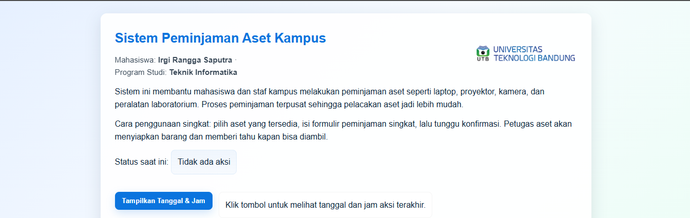
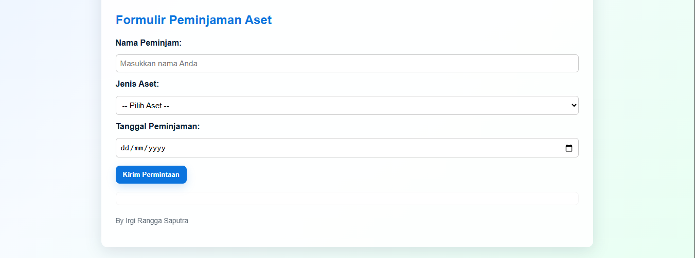

# Sistem Peminjaman Aset Kampus

Website ini merupakan halaman web sederhana berbasis **HTML, CSS, dan JavaScript** untuk simulasi sistem peminjaman aset kampus.  
Proyek ini dibuat untuk memenuhi tugas pembuatan website satu halaman dengan interaksi JavaScript.

---

## Fitur Utama

### 1. Tampilan (HTML + CSS)
- Memiliki judul halaman: **“Nama Mahasiswa”**  
- Terdiri dari **1 heading** dan **3 paragraf** penjelasan.  
- Memiliki **elemen desain** berupa warna background gradien dan tampilan modern.  
- Menampilkan **logo kampus di sebelah kanan header**.

### 2. Interaksi (JavaScript)
- Terdapat tombol **“Tampilkan Tanggal & Jam”** yang menampilkan waktu saat diklik.  
- Tombol tersebut juga mengubah teks status dan menampilkan *alert* dengan waktu aksi.  
- Memiliki **formulir peminjaman aset** yang menampilkan data input pengguna tanpa backend.

---

##  Struktur File

```
proyek-peminjaman-aset/
├── index.html → Halaman utama (HTML + JavaScript)
├── style.css → File CSS terpisah untuk tampilan
└── logo.png → Logo kampus (opsional)
```


---

## Formulir Peminjaman

Form ini digunakan untuk mensimulasikan proses peminjaman aset kampus.

**Field yang tersedia:**
- **Nama peminjam**
- **Jenis aset** (Laptop, Proyektor, Kamera, Alat Laboratorium)
- **Tanggal peminjaman**

Saat tombol **“Kirim Permintaan”** diklik, data hasil pengisian akan ditampilkan di bawah form tanpa perlu koneksi ke database.

---

## Teknologi yang Digunakan

| Teknologi | Kegunaan |
|------------|-----------|
| **HTML5** | Struktur halaman dan konten |
| **CSS3** | Desain tampilan dan layout |
| **JavaScript (DOM)** | Mengatur interaksi tombol dan form |
| **Responsive Design** | Menyesuaikan tampilan untuk perangkat mobile & desktop |

---

## Tampilan




##  Kontributor

**Nama Mahasiswa** : Irgi Rangga Saputra 
Program Studi: Teknik Informatika - Universitas Teknologi Bandung  

---

##  Lisensi

Proyek ini dibuat untuk tujuan pembelajaran dan tugas akademik.  
Anda bebas menggunakan dan memodifikasi kode ini untuk keperluan pendidikan.

---

