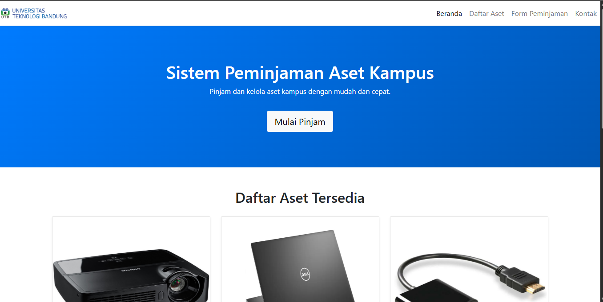
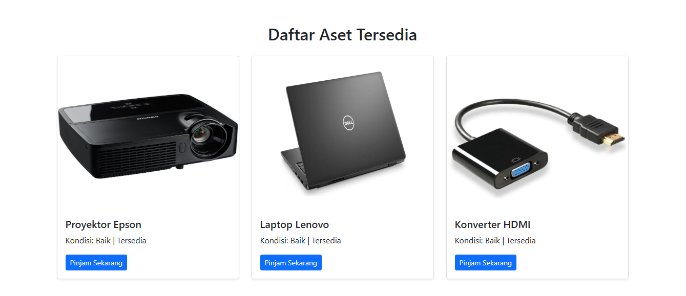
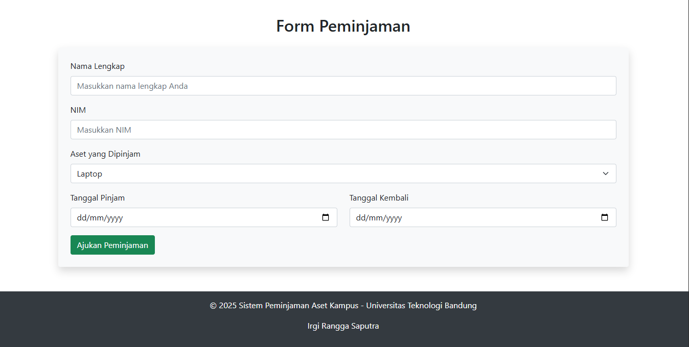

# Sistem Peminjaman Aset Kampus

Proyek ini merupakan website sederhana berbasis **HTML** dan **Bootstrap 5** untuk mengelola dan mempermudah proses peminjaman aset kampus seperti proyektor, laptop, dan konverter HDMI, dll.

---

## Fitur Utama

- **Navigasi (Navbar)** dengan menu interaktif: Beranda, Daftar Aset, Form Peminjaman, dan Kontak.  
- **Hero Section** dengan tampilan modern dan tombol cepat menuju form peminjaman.  
- **Daftar Aset Tersedia** menampilkan aset kampus lengkap dengan gambar, status, dan tombol peminjaman.  
- **Form Peminjaman** untuk mengisi data seperti nama, NIM, jenis aset, serta tanggal pinjam dan kembali.  
- **Desain Responsif** — menyesuaikan tampilan pada desktop maupun perangkat mobile.  
- **Footer** dengan informasi kampus dan nama pembuat.

---

## Teknologi yang Digunakan

- **HTML5**
- **CSS3**
- **Bootstrap 5.0.2**

---

## Cara Menjalankan

1. Pastikan kamu sudah menginstal **Laragon**, **XAMPP**, atau server lokal lain.
2. Simpan folder `Tugas1` di dalam folder `www` (Laragon) atau `htdocs` (XAMPP).
3. Jalankan server lokal kamu.
4. Buka di browser:

---

## 🖥️ Tampilan Website

Tampilan Beranda

  

Tampilan Daftar Aset

  

Tampilan Form Pengajuan

  

---

## Pembuat

**Nama:** Irgi Rangga Saputra   
**NIM:**  23552011343   
**Kampus:** Universitas Teknologi Bandung  

---

## Lisensi

Proyek ini dibuat untuk keperluan pembelajaran.  
Silakan digunakan dan dikembangkan lebih lanjut sesuai kebutuhan akademik.

